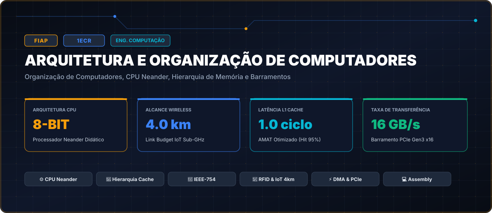

# FIAP • Arquitetura e Organização de Computadores (Turma 1ECR • 2022)

> **Engenharia da Computação — FIAP (Faculdade de Informática e Administração Paulista)**  
> **Turma:** 1ECR • Ano Letivo 2022  
> **Portal Interativo GitHub Pages:** [https://guimemee.github.io/fiap-arquitetura-e-organizacao-de-computadores/](https://guimemee.github.io/fiap-arquitetura-e-organizacao-de-computadores/)

---

## 📋 Sumário Executivo

Este repositório consolida o acervo acadêmico integral e os projetos práticos de engenharia da disciplina **Arquitetura e Organização de Computadores**, contemplando:
1. **6 Checkpoints Oficiais (2022):** Enunciados integrais originais, memórias de cálculo passo a passo no padrão Symbolab e cadernos Jupyter (`.ipynb`) com gráficos executáveis.
2. **Apostilas e Teoria:** Slides e referências didáticas.
3. **Exercícios de Laboratório:** Guias práticos e simulações.
4. **Global Solution:** Projetos integradores do semestre.

---

## 🎯 6 Checkpoints Oficiais

- **Checkpoint 1: Sistemas de Numeração e Conversões de Base:** [`01_Checkpoints_2022/Checkpoint_1_Mudanca_de_Base_Parte1e2/Resolucao_Calculos.ipynb`](01_Checkpoints_2022/Checkpoint_1_Mudanca_de_Base_Parte1e2/Resolucao_Calculos.ipynb)
- **Checkpoint 2: Complemento de 2 e Ponto Flutuante IEEE-754:** [`01_Checkpoints_2022/Checkpoint_2_Mudanca_de_Base_Parte3e4/Resolucao_Calculos.ipynb`](01_Checkpoints_2022/Checkpoint_2_Mudanca_de_Base_Parte3e4/Resolucao_Calculos.ipynb)
- **Checkpoint 3: Link Budget de Comunicação Sem Fio IoT (4 km):** [`01_Checkpoints_2022/Checkpoint_3_Projeto_IoT_RFID_Wireless4km/Resolucao_Calculos.ipynb`](01_Checkpoints_2022/Checkpoint_3_Projeto_IoT_RFID_Wireless4km/Resolucao_Calculos.ipynb)
- **Checkpoint 4: Emulação do Ciclo de Instrução da CPU Neander:** [`01_Checkpoints_2022/Checkpoint_4_Organizacao_CPU_Neander/Resolucao_Calculos.ipynb`](01_Checkpoints_2022/Checkpoint_4_Organizacao_CPU_Neander/Resolucao_Calculos.ipynb)
- **Checkpoint 5: Análise de Desempenho da Hierarquia de Memória (AMAT):** [`01_Checkpoints_2022/Checkpoint_5_Hierarquia_Memorias_e_Cache/Resolucao_Calculos.ipynb`](01_Checkpoints_2022/Checkpoint_5_Hierarquia_Memorias_e_Cache/Resolucao_Calculos.ipynb)
- **Checkpoint 6: Dimensionamento de Barramentos PCIe e Controladores DMA:** [`01_Checkpoints_2022/Checkpoint_6_Barramentos_e_Dispositivos_IO/Resolucao_Calculos.ipynb`](01_Checkpoints_2022/Checkpoint_6_Barramentos_e_Dispositivos_IO/Resolucao_Calculos.ipynb)

---

## 🏛️ Créditos e Rastreabilidade
- **Instituição:** FIAP
- **Curso:** Engenharia da Computação
- **Turma:** 1ECR • 2022
- **Aluno:** Guilherme Macario da Silva
